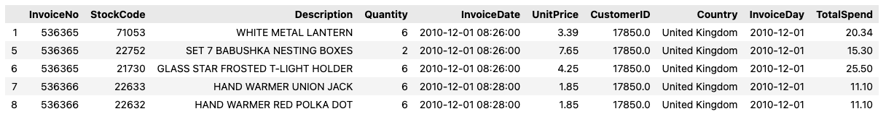
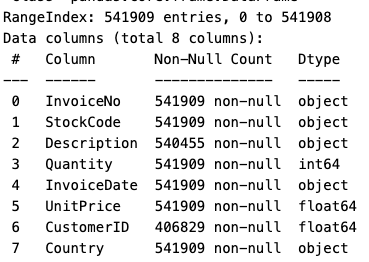
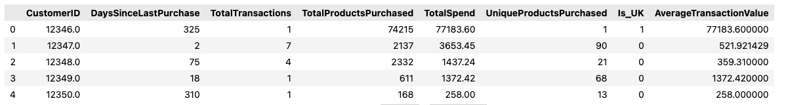
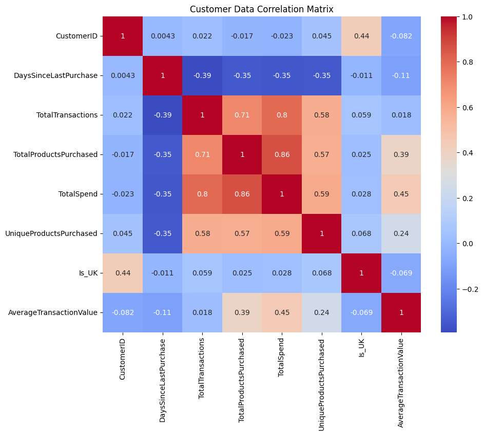
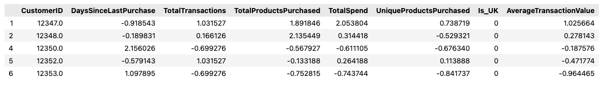
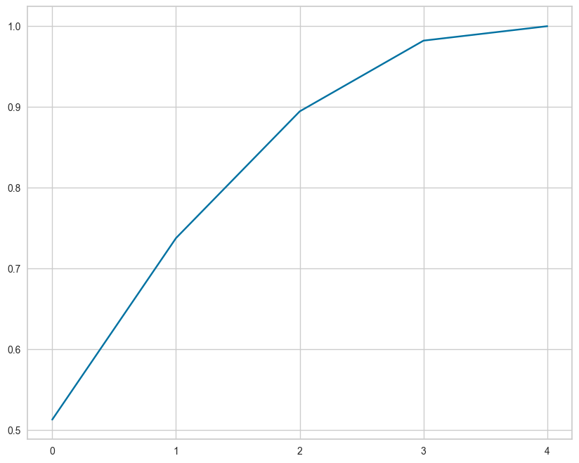
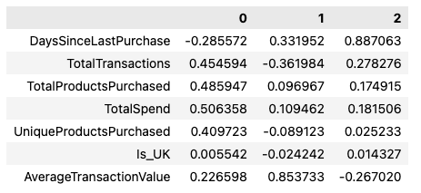
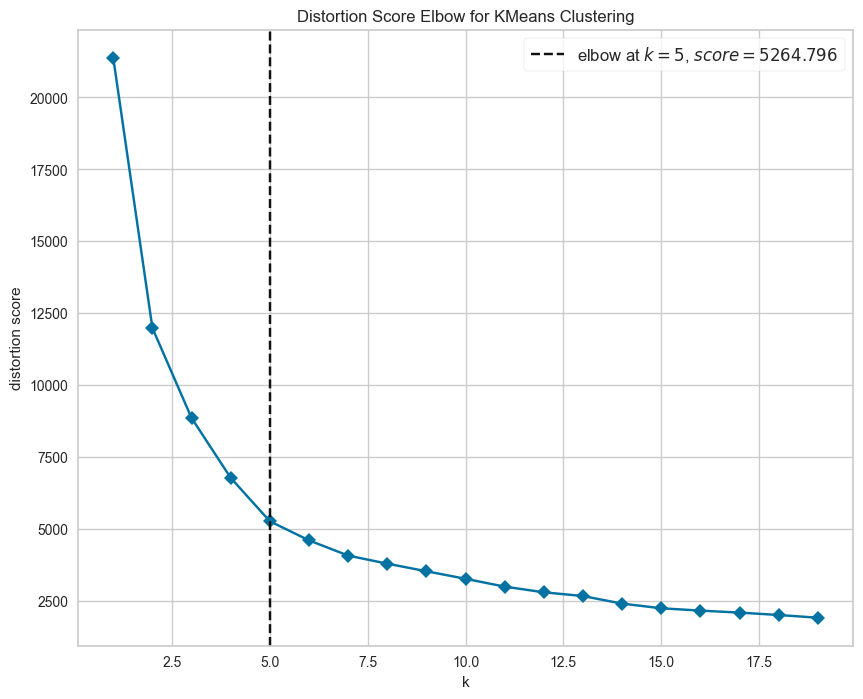
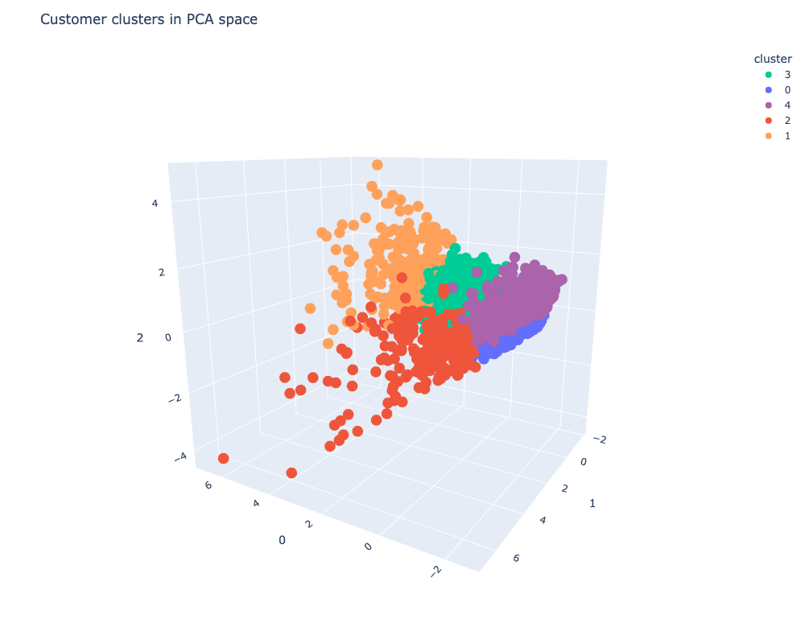

# Customer Product Recommendations.

## Objective
Purpose of this project is to create a product recommendations for the customers of a online retail store

## DATA
The dataset contains the actual transactions from 2010 and 2011 for a UK based and registered non-store online retail selling goods to wholesaler customers. This dataset is publically made available on [Kaggle site](https://www.kaggle.com/datasets/carrie1/ecommerce-data/data). its a raw dataset 

and requires preprocesing activities to remove duplicates and anomalies before it can be used for model building.

## MODEL 
The data is unlabelled. For the purpose of recommending products to customers, 
- The transactional data is transformed into customer centric data by extracting customer centic features 
  
  
- Scale the customer centric data
  
- Principal Component Analysis is applied for dimensionality reduction but retaining spread of varience.
  
  Notice that forst three PCA components captures around 86% varience which is good enough for furthet analysis.

  Also spread of PCAs across features are listed below.
  

- KMeans clustering machine learning algorithms is then applied to find customer segments
- Finally the segments are used to find the best selling products and recommend it to the customers in that segment which they have not bought yet.

## HYPERPARAMETER OPTIMSATION
Euclidian distance is used as a measure to evaluate the nearness of the data points

The optimum number of clusters **K** is identified by using [*KElbowVisualizer*](https://www.scikit-yb.org/en/latest/api/cluster/elbow.html) from *yellowbrick* library.

## RESULTS
The results of a KMeans clustering are visualised across forst 3 PCA components which captures around 86% varience.

Customer spread across the clusters

## Citations
This work is inspired by a [kaggle notebook](https://www.kaggle.com/code/farzadnekouei/customer-segmentation-recommendation-system)
