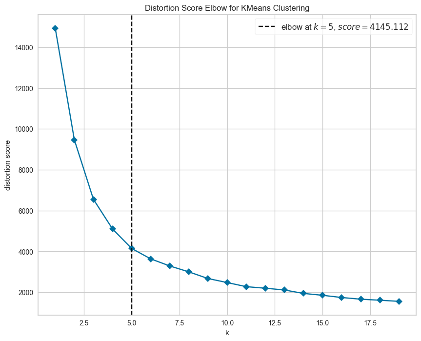

# Customer Product Recommendations.

## Objective
Purpose of this project is to create a product recommendations for the customers of a online retail store. Final recommendations are stored in the file **data/customer_recomendations.csv**.

## DATA
The dataset contains the actual transactions from 2010 and 2011 for a UK based and registered non-store online retail selling goods to wholesaler customers. This dataset is publically made available on [Kaggle site](https://www.kaggle.com/datasets/carrie1/ecommerce-data/data). its a raw dataset and requires preprocesing activities to remove duplicates and anomalies before it can be used for model building.

## MODEL 
The data is unlabelled. For the purpose of recommending products to customers, data has been pre-processed befor using for model building. The process is explained below.

- The transactional data is transformed into customer centric data by extracting customer centic features.
  
  

  

- Scale the customer centric data
  
  

- Principal Component Analysis is applied for dimensionality reduction but retaining spread of varience.
  
  

  Notice that first three PCA components captures around 90% varience which is good enough for furthet analysis.

  

  Also spread of PCAs across features are listed below.

  

- Hierarchial Clustering is applied to have quick view of the distribution
  
  

- KMeans clustering machine learning algorithms is then applied to find customer segments
- Finally the segments are used to find the best selling products and recommend it to the customers in that segment which they have not bought yet.

## HYPERPARAMETER OPTIMSATION
Euclidian distance is used as a measure to evaluate the nearness of the data points

The optimum number of clusters **K** is identified by using [*KElbowVisualizer*](https://www.scikit-yb.org/en/latest/api/cluster/elbow.html) from *yellowbrick* library.

Number of optimum clusters are found to be 5

## RESULTS
The results of a KMeans clustering are visualised across first 3 PCA components which captures around 90% varience.

Customer spread across the clusters.

Features distribution across the clusters.

The results of the KMeans clustering are used to assign cluster label to the customer data. The data then used to find the best selling product in that cluster which a customer has not bought yet and add it as a recommendation.

Recommendations are saved in the file **./data/customer_recommendations.csv**

Only one product recomendations is selected, however last step can be easily extended to recomment more than one products.

## Citations
This work is inspired by a [kaggle notebook](https://www.kaggle.com/code/farzadnekouei/customer-segmentation-recommendation-system)
