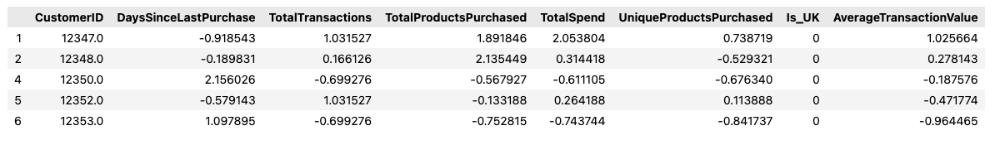
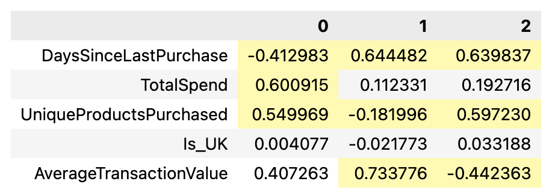
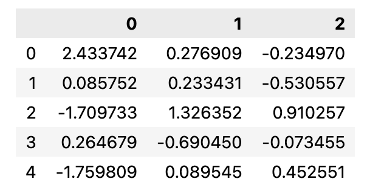
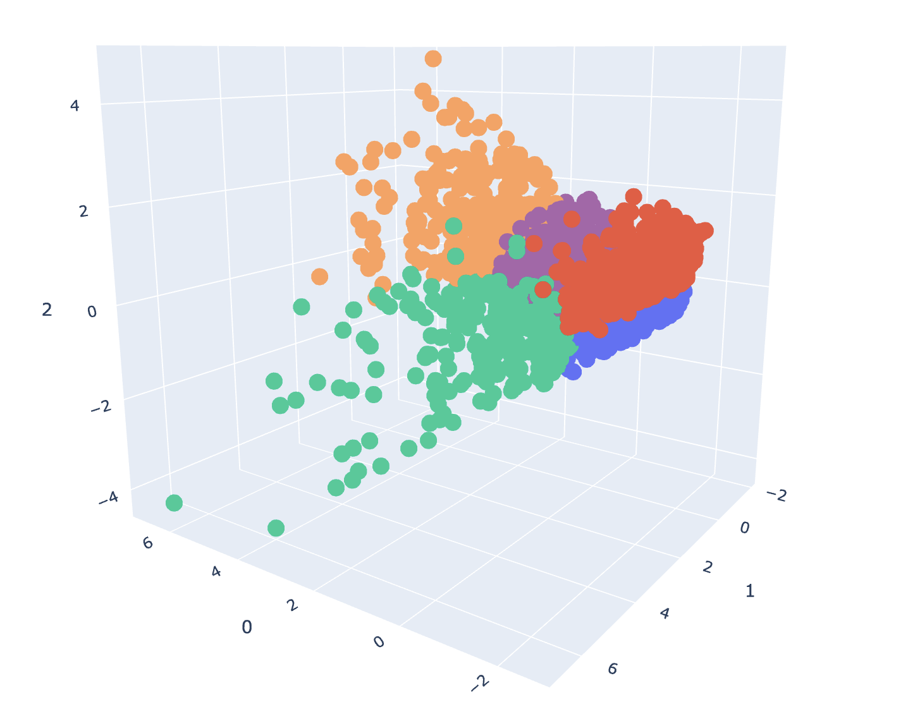

# Model Card

## Model Description
This model aims to enhance marketing strategy and improve the efficiancy by create product recommendation to the customer based on previous transactional data. The recommended product woudl be the one which is best selling in that customer segment and the one which customer has not bought yet.

**Input:** 
Model input is a raw transactions text data in CSV format, the data is preprocessed and transformed for model building

**Output:** 
Model aims to create customer segments which can then be targetted for efficiant marketing. like recommend a product to a customers in that segment which they have not yet bought.

**Model Architecture:**: 
The KNN model use data produced after Principal Component Analysis of scaled customer centric features which are derived by processing raw transactional data in CSV format
| Type | Data |
|------|------|
| Raw Data |  |
| Customer Data |  |
| Scaled Customer Data |  |
| PCA |  |
| PCA spread | First 5 PCA components which captures around 90% varience.  |

KNN algorithm finally produce customer segmentation clusters.

## Performance 
### KMeans

| Metric | Score | Description |
|--------|-------|-------------|
| Slihoutte Score | **0.3450** | Indicates fare amount of separation between the clusters |
| Calinski Harabasz Score | **1919.00** |Considerably high, indicating clusters are well defined |
| Davies Bouldin Score | **1.0767** | Indicates good separation between the clusters |

## Limitations

- The model can only be used for the intended purpose which is to create product recommendations.
- For a new customer, segment assigment data processing steps such as feature extraction, PCA etc. would need to be re-applied.
- The process would some lead time and data collection activities before makiing effective recommendations.
- This model does not consider customers product returned / cancellation behaviour during recommendations.
- Only one product is recommended as of now, however it is possible to male more than one recommendations.

## Trade-offs
- More segments (clusters) might emerge over the time when more and more data is available.
- The model may become memory intensive with larget dataset.
